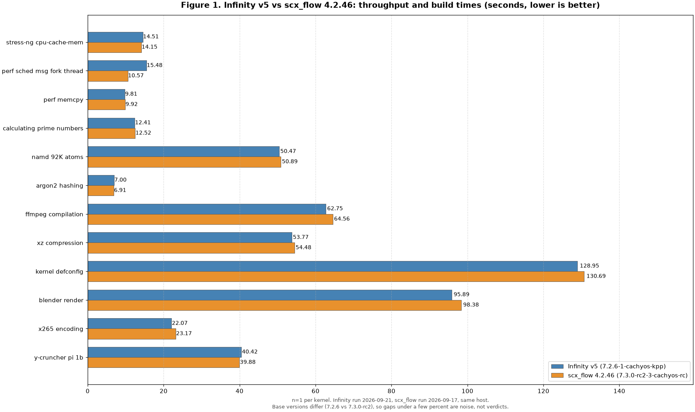
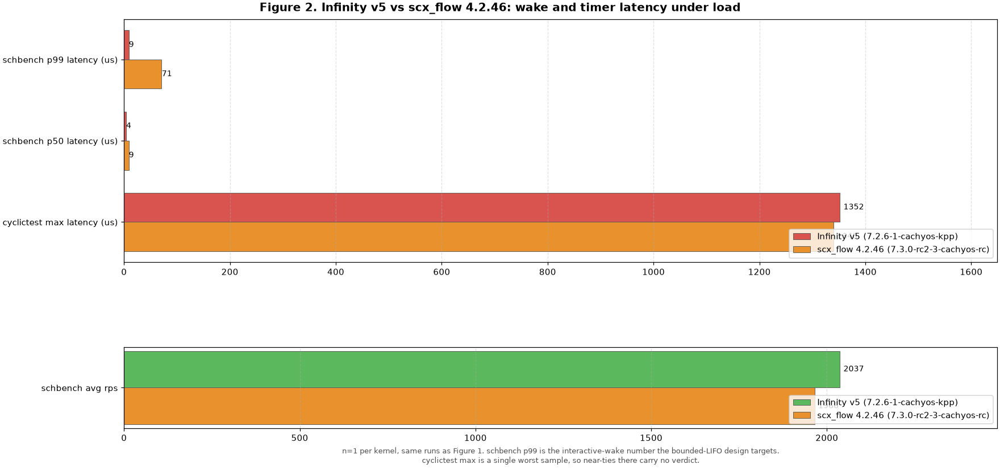

# Infinity Scheduler

This project is an attempt to modify Fair, RT, and the DRM GPU schedulers to give consistent performance and latency under load, optimized for modern-day desktop interactivity.
It uses a completely different approach compared to the [old version of the Infinity project](https://github.com/galpt/infinity-scheduler).

> [!NOTE]
> 1. This project is not for beginners. You are expected to already know how to work with patch files. You are welcome to be an early tester and your feedback would be greatly appreciated.
> 2. The patches are intended to be applied together for Infinity to work correctly as a complete scheduler. Applying only part of the series (for example the CPU patches without the GPU patch, or vice versa) may result in unintended side effects.
> 3. Currently only the CachyOS 7.2 version is supported. Support for other kernel versions or other distros will follow after the 7.2 version is considered stable.

## How to build a patched kernel

Fetch this repo without its history to save time, then pick the 7.2 series and apply it in series order, fair first, then rt, then gpu. Check that each patch applies cleanly with zero fuzz, then build as usual.

```sh
git clone --depth 1 https://github.com/galpt/infinity-sched-new.git
cd /path/to/linux-7.2.6
patch -p1 -N -F 0 --dry-run < /path/to/infinity-sched-new/patches/7.2/cpu/fair/0001-infinity-fair-7.2.patch
patch -p1 -N -F 0 --dry-run < /path/to/infinity-sched-new/patches/7.2/cpu/rt/0001-infinity-rt-7.2.patch
patch -p1 -N -F 0 --dry-run < /path/to/infinity-sched-new/patches/7.2/gpu/0001-infinity-drm-7.2.patch
patch -p1 -N -F 0 < /path/to/infinity-sched-new/patches/7.2/cpu/fair/0001-infinity-fair-7.2.patch
patch -p1 -N -F 0 < /path/to/infinity-sched-new/patches/7.2/cpu/rt/0001-infinity-rt-7.2.patch
patch -p1 -N -F 0 < /path/to/infinity-sched-new/patches/7.2/gpu/0001-infinity-drm-7.2.patch
make -j$(nproc)
```

Check apply state with git and lint each patch with checkpatch in strict mode.

```sh
git apply --check patches/7.2/cpu/fair/0001-infinity-fair-7.2.patch
git apply --check patches/7.2/cpu/rt/0001-infinity-rt-7.2.patch
git apply --check patches/7.2/gpu/0001-infinity-drm-7.2.patch
perl scripts/checkpatch.pl --strict --patch patches/7.2/cpu/fair/0001-infinity-fair-7.2.patch
perl scripts/checkpatch.pl --strict --patch patches/7.2/cpu/rt/0001-infinity-rt-7.2.patch
perl scripts/checkpatch.pl --strict --patch patches/7.2/gpu/0001-infinity-drm-7.2.patch
```

Fallback is a revert of one patch or of the whole series. Each patch reverses cleanly on its own, and the drm policy reverts at runtime with sched_policy=1. To drop the series from a tree, reverse in gpu, rt, fair order.

```sh
cd /path/to/linux-7.2.6
patch -p1 -R < /path/to/infinity-sched-new/patches/7.2/gpu/0001-infinity-drm-7.2.patch
patch -p1 -R < /path/to/infinity-sched-new/patches/7.2/cpu/rt/0001-infinity-rt-7.2.patch
patch -p1 -R < /path/to/infinity-sched-new/patches/7.2/cpu/fair/0001-infinity-fair-7.2.patch
```

## How it is checked

On a booted kernel, confirm Infinity is running by reading the debugfs boxes. Counters at zero on an idle machine mean the discipline is live but quiet. Rising head and tail counts under load mean it is scheduling.

```sh
sudo cat /sys/kernel/debug/infinity_fair
sudo cat /sys/kernel/debug/infinity_rt
sudo cat /sys/kernel/debug/infinity_drm
```

## Benchmarks

Numbers come from the CachyOS benchmarker on one machine under load, Infinity v5 on 7.2.6 against scx_flow 4.2.46 on 7.3.0-rc2. The harness output plus the raw CSV files plus the plot script live under benchmarks, so anyone can rerun or redraw them.

Figure 1 covers throughput and build times. Infinity leads 8 of 12 tests by 1 to 4 percent, with the clearest gaps on ffmpeg, xz, kernel defconfig, blender, and x265. scx_flow leads stress-ng, y-cruncher, and argon2 by similar small margins. The one large gap runs the other way, with perf sched msg fork thread at 15.48s against 10.57s, and that test hammers exactly the fork plus thread plus messaging paths where a young rewrite has the most room to improve. Base versions differ across the two runs, so gaps under a few percent are noise, not verdicts.



Figure 2 covers wake and timer latency, which is what the bounded-LIFO design targets. schbench p99 lands at 9us against 71us, p50 at 4us against 9us, and schbench throughput at 2037rps against 1966rps. cyclictest worst sample ties at 1352us against 1340us, and a single worst sample carries no verdict either way. Each run is a single sample per kernel, so treat the small gaps as direction, not proof.

The reported `p50` and `p99` values are wakeup latencies. They come from the Wakeup block produced by the command below. The harness keeps the first match, so the Request block is not used.

```sh
schbench -m 2 -r 30
```

For end user feel, `p50` shows typical latency, while `p99` shows near worst latency seen by one in one hundred wakeups, so it guards against stutter.

Request latencies are on a millisecond scale and are not reported here. The split of wakeup and request latencies follows the same idea as in `sched-ext/scx#3825`, but the values are not directly comparable because the machine and the load shape and the kernel base are different, and each result is a single sample.



## Credits

v5 is a clean rewrite built on bounded-LIFO with a weighted 1ms quantum, so most entries below honor work on the previous implementation that made this rewrite possible.

- **[EEVDF](https://git.kernel.org/pub/scm/linux/kernel/git/torvalds/linux.git/tree/kernel/sched/fair.c)** — Earliest Eligible Virtual Deadline First scheduling algorithm by Ion Stoica and Hussein Abdel-Wahab (1995), implemented in the Linux kernel by Peter Zijlstra and the kernel community. EEVDF serves as the foundation that the Infinity scheduler modifies.
- Exploration of bounded-LIFO and fair share ideas informed by [scx_flow](https://github.com/galpt/scx_flow_new/tree/main) and [KPP](https://github.com/galpt/kpp-iosched), studied as background for the previous implementation and carried forward only as design thinking.
- [BORE](https://github.com/firelzrd/bore-scheduler) by Masahito S, whose burst scoring research informed exploration in the previous implementation.
- [BMQ / PDS / LF-BMQ](https://gitlab.com/alfredchen/projectc) by Alfred Chen, whose scheduler research informed exploration in the previous implementation.
- [Tvrtko Ursulin, Fair(er) DRM GPU scheduler](https://blogs.igalia.com/tursulin/fair-er-drm-gpu-scheduler/), whose fair GPU scheduling research informed exploration in the previous implementation.
- [LINUX DO](https://linux.do/), for discussion and support during development of the previous implementation.
- [CachyOS community](https://cachyos.org/), for testing and feedback during development of the previous implementation.
- [u3z05en](https://github.com/u3z05en), Jonathan, for code review that made the previous implementation more correct and robust.
- [lostf1sh](https://github.com/lostf1sh), for bug reports and code review on the previous implementation.
- [RiverOnVenus](https://github.com/RiverOnVenus), for code review on the previous implementation.
- [dim-geo](https://github.com/dim-geo), for CachyOS packaging of the 7.1 series in the previous repository line.
- [sxlmnwb](https://github.com/sxlmnwb), Salman Wahib, for the `infinity_stats` heap allocation fix in the previous implementation. This rewrite carries its own debugfs stats instead.
